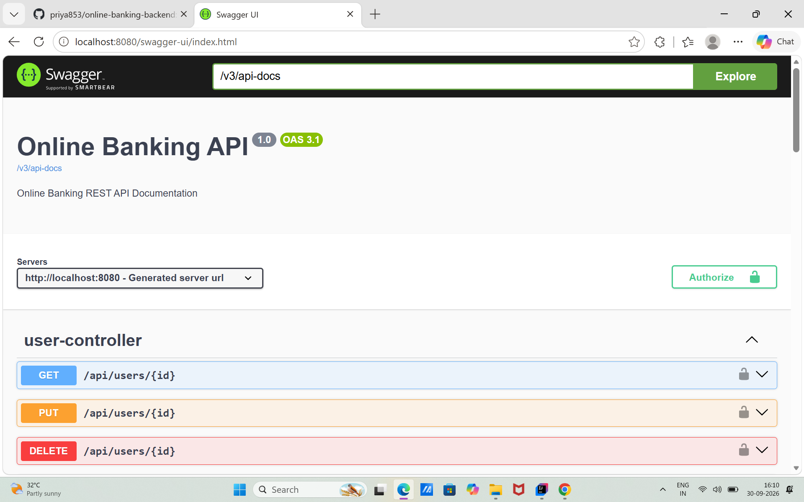

#  Online Banking Backend

A secure and modular **Online Banking REST API** built using **Java, Spring Boot, Spring Security, JWT Authentication, Spring Data JPA, Hibernate, and MySQL**.

This backend provides RESTful APIs for user authentication, bank account management, deposits, withdrawals, money transfers, transaction history, user dashboard, and administrator operations.

---

##  Project Overview

The Online Banking Backend is a backend application designed to simulate core banking operations through secure REST APIs.

The application implements:

- User registration and login
- JWT-based authentication
- Role-based authorization
- Bank account creation and management
- Deposit and withdrawal operations
- Account-to-account money transfers
- Transaction history
- User dashboard
- Admin user management
- User blocking and activation
- Request validation
- Global exception handling
- Swagger/OpenAPI API documentation

---

##  Technologies Used

### Backend

- Java
- Spring Boot
- Spring Security
- JWT Authentication
- Spring Data JPA
- Hibernate
- REST APIs
- Jakarta Validation

### Database

- MySQL

### Tools

- IntelliJ IDEA
- Maven
- Git
- GitHub
- Postman
- Swagger UI
- SQLyog

---

## Architecture 

The application follows a layered Spring Boot architecture that separates API handling, business logic, database operations, security, and configuration.

### Application Architecture

```text
Client
  │
  ▼
Controller Layer
  │
  ▼
Service Layer
  │
  ▼
Repository Layer
  │
  ▼
MySQL Database
```

### Project Structure

```text
src
└── main
    ├── java
    │   └── com.onlinebanking
    │       ├── config
    │       │   ├── AdminDataInitializer.java
    │       │   ├── OpenApiConfig.java
    │       │   └── SecurityConfig.java
    │       │
    │       ├── controller
    │       │   ├── AdminController.java
    │       │   ├── AuthController.java
    │       │   ├── BankAccountController.java
    │       │   ├── DashboardController.java
    │       │   ├── GlobalExceptionHandler.java
    │       │   ├── TestController.java
    │       │   ├── TransactionController.java
    │       │   ├── TransferController.java
    │       │   └── UserController.java
    │       │
    │       ├── dto
    │       │   ├── AccountResponse.java
    │       │   ├── AdminAccountResponse.java
    │       │   ├── AdminTransactionResponse.java
    │       │   ├── AdminUserResponse.java
    │       │   ├── DashboardResponse.java
    │       │   ├── DepositRequest.java
    │       │   ├── LoginRequest.java
    │       │   ├── TransactionResponse.java
    │       │   ├── TransferRequest.java
    │       │   ├── UserResponse.java
    │       │   └── WithdrawRequest.java
    │       │
    │       ├── entity
    │       │   ├── BankAccount.java
    │       │   ├── Transaction.java
    │       │   └── User.java
    │       │
    │       ├── repository
    │       │   ├── BankAccountRepository.java
    │       │   ├── TransactionRepository.java
    │       │   └── UserRepository.java
    │       │
    │       ├── security
    │       │   └── JwtAuthenticationFilter.java
    │       │
    │       └── service
    │           ├── BankAccountService.java
    │           ├── DashboardService.java
    │           ├── JwtService.java
    │           ├── TransactionService.java
    │           ├── TransferService.java
    │           └── UserService.java
    │
    └── resources
        └── application.properties
```

### Layer Responsibilities

| Layer / Package | Responsibility |
|---|---|
| **Controller** | REST API endpoints handle karta hai aur client requests receive karta hai. |
| **Service** | Application ki business logic handle karta hai. |
| **Repository** | Spring Data JPA ke through database operations handle karta hai. |
| **Entity** | Database tables aur relationships ko represent karta hai. |
| **DTO** | API request aur response data ko handle karta hai. |
| **Security** | JWT authentication aur protected API requests handle karta hai. |
| **Config** | Security, Swagger/OpenAPI aur application initialization configuration handle karta hai. |

### Security Flow

```text
User Login
    │
    ▼
Email + Password
    │
    ▼
AuthController
    │
    ▼
Password Verification
    │
    ▼
JWT Token Generated
    │
    ▼
Client Sends Bearer Token
    │
    ▼
JwtAuthenticationFilter
    │
    ▼
JWT Validation + User Verification
    │
    ▼
Protected Controller
    │
    ▼
Service Layer
```

### Banking Transaction Flow

```text
Client Request
      │
      ▼
Controller
      │
      ▼
Authentication & Authorization
      │
      ▼
Service
      │
      ├── Validate Request
      ├── Validate Account Ownership
      ├── Apply Banking Operation
      └── Create Transaction Record
      │
      ▼
Repository
      │
      ▼
MySQL Database
```

---

##  Security Features

The application uses Spring Security and JWT authentication to protect secured APIs.

### Authentication

- User login using email and password
- Password encryption using BCrypt
- JWT token generation after successful login
- JWT token validation for protected APIs
- JWT expiration handling

### Authorization

- Role-based authorization
- `ROLE_USER`
- `ROLE_ADMIN`
- Admin-only endpoints
- Users can access only their own bank accounts and transaction data

### Account Protection

- Blocked users cannot log in
- Existing JWT access is also blocked for blocked users
- Unauthorized users cannot access another user's account information

---

##  Key Features

###  User Management

- Register new users
- Login users
- Get user information
- Update user information
- Delete users
- Duplicate email validation

###  Bank Account Management

- Create bank accounts
- Generate unique account numbers
- View user's accounts
- View account details
- Check account balance

###  Banking Operations

- Deposit money
- Withdraw money
- Insufficient balance validation
- Positive amount validation

###  Money Transfer

- Transfer money between bank accounts
- Validate sender account ownership
- Validate receiver account
- Prevent transfer to the same account
- Check sufficient balance
- Record transfer transactions

###  Transaction Management

- View transaction history for an account
- View transactions across user's accounts
- Record deposits
- Record withdrawals
- Record sent transfers
- Record received transfers

###  Dashboard

The dashboard provides:

- User name
- Total number of accounts
- Total balance
- Recent transactions

###  Admin Management

Administrators can:

- View all users
- View all bank accounts
- View all transactions
- Block users
- Activate users

---

##  API Endpoints

###  Authentication

| Method | Endpoint | Description |
|---|---|---|
| POST | `/api/auth/login` | User/Admin login |

###  User APIs

| Method | Endpoint | Description |
|---|---|---|
| POST | `/api/users` | Register user |
| GET | `/api/users` | Get all users |
| GET | `/api/users/{id}` | Get user by ID |
| PUT | `/api/users/{id}` | Update user |
| DELETE | `/api/users/{id}` | Delete user |

###  Bank Account APIs

| Method | Endpoint | Description |
|---|---|---|
| POST | `/api/accounts` | Create bank account |
| GET | `/api/accounts/my-accounts` | Get logged-in user's accounts |
| GET | `/api/accounts/{accountNumber}` | Get account details |
| POST | `/api/accounts/{accountNumber}/deposit` | Deposit money |
| POST | `/api/accounts/{accountNumber}/withdraw` | Withdraw money |

###  Transfer API

| Method | Endpoint | Description |
|---|---|---|
| POST | `/api/transfers` | Transfer money between accounts |

###  Transaction APIs

| Method | Endpoint | Description |
|---|---|---|
| GET | `/api/transactions/my-transactions` | Get logged-in user's transactions |
| GET | `/api/transactions/account/{accountNumber}` | Get account transaction history |

###  Dashboard API

| Method | Endpoint | Description |
|---|---|---|
| GET | `/api/dashboard` | Get user dashboard information |

###  Admin APIs

| Method | Endpoint | Description |
|---|---|---|
| GET | `/api/admin/users` | View all users |
| PUT | `/api/admin/users/{id}/block` | Block user |
| PUT | `/api/admin/users/{id}/activate` | Activate user |
| GET | `/api/admin/accounts` | View all accounts |
| GET | `/api/admin/transactions` | View all transactions |

> Admin APIs require an authenticated user with the `ROLE_ADMIN` authority.

---

##  Database

The application uses MySQL.

### Database

```text
online_banking
```

### Main Tables

```text
users
bank_accounts
transactions
```

### Entity Relationship

```text
User
 │
 └── BankAccount
       │
       └── Transactions
```

---

##  Environment Variables

Sensitive configuration values are provided through environment variables.

Required variables:

```text
DB_PASSWORD
JWT_SECRET
ADMIN_PASSWORD
```

Example:

```text
DB_PASSWORD=your_database_password
JWT_SECRET=your_jwt_secret
ADMIN_PASSWORD=your_admin_password
```

> Do not commit actual passwords, JWT secrets, or database credentials to GitHub.

---

##  How to Run

### 1. Clone the Repository

```bash
git clone https://github.com/priya853/online-banking-backend.git
```

### 2. Open the Project

Open the project in IntelliJ IDEA.

### 3. Configure MySQL

Create the database:

```sql
CREATE DATABASE online_banking;
```

Make sure MySQL Server is running.

### 4. Configure Environment Variables

Set the following environment variables in the IntelliJ Run Configuration:

```text
DB_PASSWORD
JWT_SECRET
ADMIN_PASSWORD
```

### 5. Run the Application

Run the Spring Boot application from IntelliJ IDEA.

The application runs on:

```text
http://localhost:8080
```

---

##  Swagger API Documentation

Swagger UI is available at:

```text
http://localhost:8080/swagger-ui/index.html


```
### Swagger UI



Swagger provides interactive documentation for the REST APIs.

JWT authentication can be configured using the **Authorize** button in Swagger UI.

---

##  API Testing

The APIs were tested using **Postman** and **Swagger UI**.

Testing includes:

- User registration
- Duplicate email validation
- Login authentication
- JWT generation
- Protected API access
- Account creation
- Deposit
- Withdrawal
- Insufficient balance validation
- Money transfer
- Transaction history
- Dashboard
- Admin APIs
- User blocking
- User activation
- Unauthorized access
- Role-based authorization

---

##  Banking Transaction Flow

### Deposit

```text
User
 ↓
Deposit Request
 ↓
Account Ownership Validation
 ↓
Balance Updated
 ↓
Transaction Created
```

### Withdrawal

```text
User
 ↓
Withdrawal Request
 ↓
Account Ownership Validation
 ↓
Balance Validation
 ↓
Balance Updated
 ↓
Transaction Created
```

### Transfer

```text
Sender
 ↓
Sender Account Validation
 ↓
Balance Validation
 ↓
Amount Deducted
 ↓
Receiver Account Credited
 ↓
Sender Transaction Created
 ↓
Receiver Transaction Created
```

---

##  Error Handling

The application provides centralized exception handling using `GlobalExceptionHandler`.

Example:

```json
{
  "status": 400,
  "message": "Insufficient balance"
}
```

Validation errors are also returned with appropriate HTTP status codes.

---

##  Future Enhancements

Possible future improvements include:

- React.js frontend
- Email notifications
- OTP-based authentication
- Forgot password functionality
- Pagination
- Search and filtering
- Advanced admin dashboard
- Account statement generation
- Docker deployment
- Cloud deployment
- Automated unit and integration testing

---

##  Project Status

**Backend:** Completed and tested

**Frontend:** Planned as a future enhancement

---

## 💻 Author

**Priyanka Chavan**

Java Full Stack Developer

### Technologies

Java | Spring Boot | Spring Security | JWT | React.js | MySQL | REST APIs

---

##  If You Find This Project Useful

Feel free to explore the repository and provide feedback.
